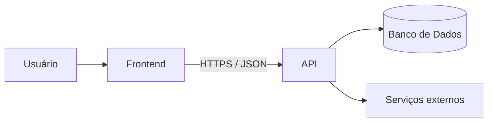
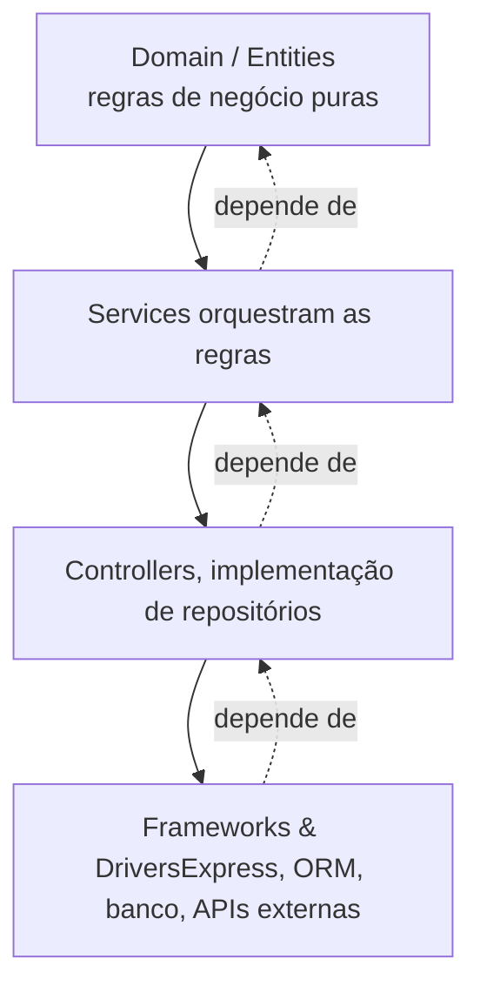
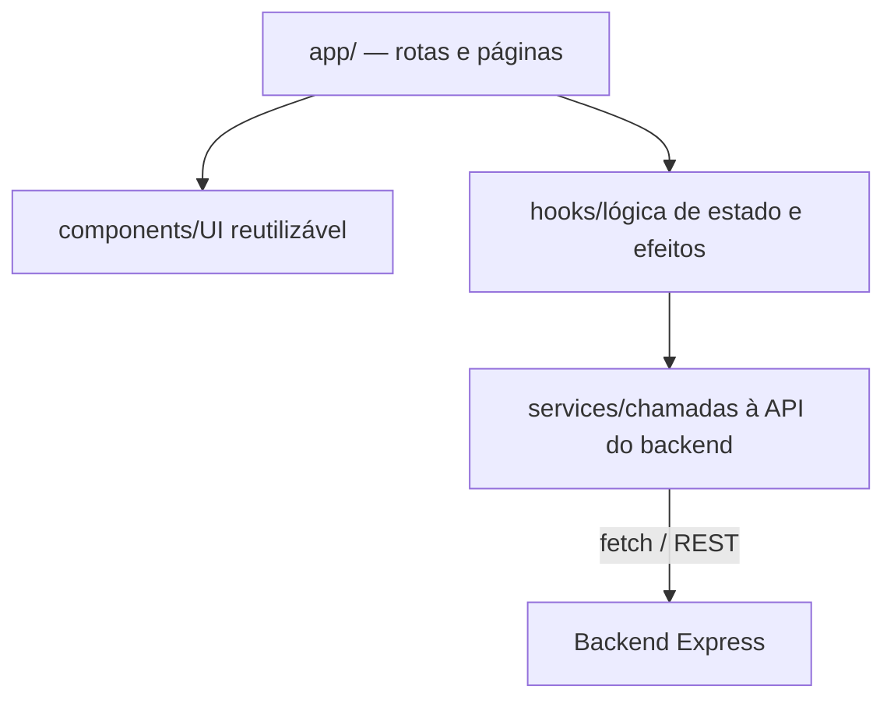
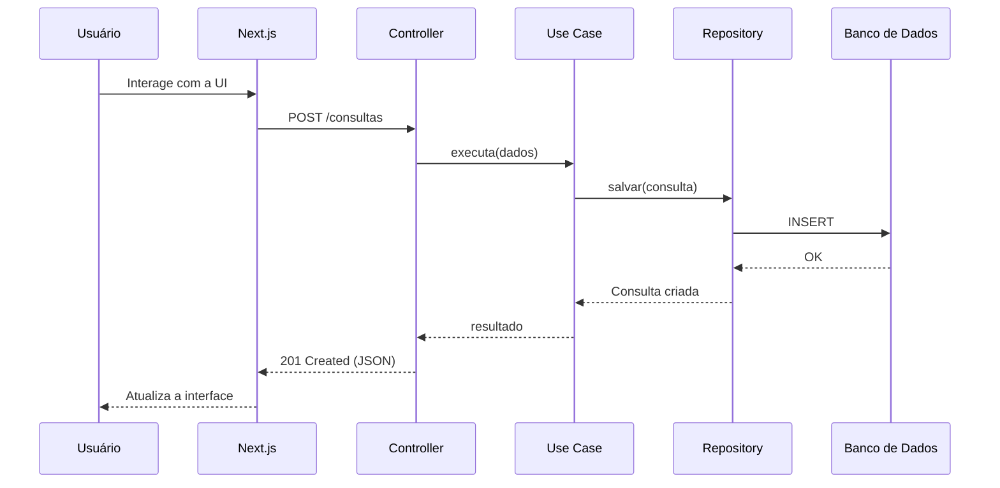

# VidaPlena — Arquitetura do Sistema

Esquema de arquitetura para o serviço web VidaPlena: backend em Express.js seguindo Clean Architecture e princípios SOLID, e frontend em Next.js seguindo sua convenção de organização por App Router.

## Visão geral

O sistema é dividido em duas aplicações independentes que se comunicam via API REST: o **frontend Next.js**, responsável pela interface e experiência do usuário, e o **backend Express**, responsável pelas regras de negócio, persistência e integrações.



Essa separação permite evoluir e escalar cada camada de forma independente, e mantém o backend agnóstico de como a interface é construída.

BACKEND

## Express.js com Clean Architecture

O backend é organizado em camadas concêntricas. A regra de dependência é única: **camadas externas dependem das internas, nunca o contrário**. O Express fica na borda, como um detalhe de implementação — não no centro da aplicação.



### Camadas

- **Domain (Entities):** entidades e regras de negócio da VidaPlena, sem nenhuma dependência de framework.
- **Services:** um caso de uso por ação do sistema (ex: `CriarUsuario`, `AgendarConsulta`), dependendo apenas de interfaces (portas), nunca de implementações concretas.
- **Controllers:** controllers que traduzem requisições HTTP em chamadas aos use cases, e implementações de repositórios que satisfazem as interfaces do domínio.
- **Frameworks & Drivers:** Express, rotas, ORM/driver de banco, clients HTTP — tudo que é detalhe técnico e substituível.

## Princípios SOLID aplicados

### S

**Single Responsibility**: Cada use case, controller e repositório tem um único motivo para mudar. Controllers não contêm regra de negócio; use cases não conhecem o Express.

### O

**Open/Closed**: Novas regras (ex: novo método de notificação) são adicionadas via novas implementações de interfaces, sem alterar código existente.

### L

**Liskov Substitution**: Qualquer implementação de uma interface de repositório (ex: `PostgresUsuarioRepository`, `InMemoryUsuarioRepository` para testes) pode substituir outra sem quebrar o use case.

### I

**Interface Segregation**: Interfaces pequenas e específicas por necessidade (ex: `LeitorDeUsuario`, `EscritorDeUsuario`) em vez de uma interface genérica de repositório.

### D

**Dependency Inversion**: Use cases dependem de abstrações (interfaces definidas no domínio); as implementações concretas são injetadas na borda da aplicação (composition root).

## Estrutura de pastas

```
src/
├── domain/
│   ├── entities/
│   │   └── Usuario.ts
│   └── repositories/          # interfaces (portas)
│       └── UsuarioRepository.ts
├── application/
│   └── use-cases/
│       └── CriarUsuario.ts
├── infrastructure/
│   ├── database/
│   │   └── PostgresUsuarioRepository.ts
│   └── http/
│       ├── express/
│       │   ├── routes/
│       │   └── server.ts
│       └── controllers/
│           └── UsuarioController.ts
└── shared/
    └── app.ts    # app
```

FRONTEND

## Next.js — App Router

O frontend segue a organização nativa do Next.js: rotas definidas pela estrutura de pastas em `app/`, com separação clara entre páginas, componentes, lógica de dados e chamadas ao backend.



### Estrutura de pastas sugerida

```
app/
├── (public)/
│   └── login/page.tsx
├── (app)/
│   ├── dashboard/page.tsx
│   └── consultas/page.tsx
├── layout.tsx
components/
├── ui/                  # botões, inputs, cards
└── consultas/           # componentes específicos do domínio
hooks/
└── useConsultas.ts
services/
└── api/
    └── consultasApi.ts  # cliente HTTP para o backend
lib/
└── utils.ts
```

Server Components buscam dados diretamente via `services/` quando possível; Client Components usam os `hooks/` para estado e interações.

## Comunicação frontend ↔ backend

A comunicação acontece via API REST, com JSON como formato de troca. O backend expõe endpoints por recurso (ex: `/usuarios`, `/consultas`); o frontend consome esses endpoints através da camada `services/`, que centraliza URLs, headers e tratamento de erros — nenhum componente chama `fetch` diretamente.

## Fluxo de uma requisição



VidaPlena — documento de arquitetura técnica
